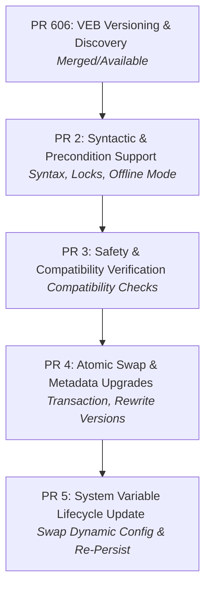

# PR Split Plan: UPDATE/ALTER EXTENSION

This document outlines the step-by-step strategy for splitting the substantial changes implementing the `UPDATE/ALTER EXTENSION` feature into a series of **5 progressive, compile-safe, and reviewable Pull Requests**.

---

## Architectural Dependency Flow

---

## PR 1 (Completed): VEB Versioning & Discovery
* **Status**: Submitted as **PR 606**.
* **Purpose**: Establish version extraction from `manifest.json` and support `{name}-{version}.veb` filename patterns.
* **Changes**:
  * Added versioned package file matching and manifest parsing.
  * Added parser rule support for `INSTALL EXTENSION name VERSION 'x.y.z'`.
* **Primary Files**:
  * `villagesql/veb/veb_file.h` / `veb_file.cc`
  * `sql/sql_yacc.yy`
* **Verification**: `extension_install_version.test` checks that correct package versions are resolved and parsed.

---

## PR 2: Syntactic & Precondition Support
* **Purpose**: Introduce the core syntax for updates and validate administrative preconditions without changing database catalog state.
* **Proposed Changes**:
  * Parse `ALTER EXTENSION name UPDATE TO 'x.y.z'` (mapping to `Sql_cmd_install_extension` with `update = true`).
  * Declare `Sql_cmd_install_extension::execute_update` stub.
  * Implement initial administrative checks inside the update driver:
    * Require `offline_mode = ON`.
    * Verify that no active non-admin database connections exist.
    * Acquire exclusive statement-level metadata locks (`MDL_STATEMENT`).
  * Add the architectural documentation files.
* **Primary Files**:
  * `sql/sql_yacc.yy`
  * `villagesql/veb/sql_extension.h` / `sql_extension.cc`
  * `Docs/EXTENSION_UPDATE.md`
  * `Docs/EXTENSION_UPDATE_IMPL.md`
  * `Docs/EXTENSION_UPDATE_REPLICATION.md`
* **Verification**:
  * Run `extension_offline_mode_install_uninstall.test` to verify that updates abort cleanly if `offline_mode` is disabled or active user queries are detected.

---

## PR 3: Safety & Compatibility Verification
* **Purpose**: Implement layout and dependency validations to guarantee that in-place updates do not corrupt data or break database schemas.
* **Proposed Changes**:
  * Implement `check_update_compatibility()`: Scans all types present in both old and new registrations and verifies that `persisted_length` matches.
  * Implement `check_dropped_types_have_no_dependents()`: Ensures any custom types being dropped by the new version are not in use by table columns or stored procedure parameters.
  * Wire these check routines into the pre-update phase.
* **Primary Files**:
  * `villagesql/veb/sql_extension.cc`
* **Verification**:
  * Run `extension_type_drop_update.test` along with test extensions `type_drop_update_v1.cc` and `type_drop_update_v2.cc` to verify layout-incompatibilities and dropped-type dependencies are blocked.

---

## PR 4: Atomic Swap & Metadata Upgrades in Victionary
* **Purpose**: Perform catalog modifications atomically inside a single transaction, swap registrations, and update existing column metadata.
* **Proposed Changes**:
  * Update `register_validated_extension()` in `register.cc` to support `thd_for_pending`, allowing session-local lookups to avoid false collision matches during updates.
  * Implement transaction management: open Villagesql system tables (`custom_columns`, `custom_sp_params`, `extensions`) for write.
  * Unregister the old extension version, mark the new registration for insertion, and write changes atomically.
  * Implement `rewrite_column_and_sp_param_versions()`: Rewrites existing columns and parameter version references in system tables to point to the new extension version.
  * Postpone unloading the old `.so` library until the transaction successfully commits.
* **Primary Files**:
  * `villagesql/veb/register.h` / `register.cc`
  * `villagesql/veb/sql_extension.cc`
* **Verification**:
  * Run `extension_update.test`, `extension_update_overwrite.test`, and `extension_update_refcount.test` (with mock extensions `update_v1.cc`, `update_v1_patched.cc`, `update_v2.cc`) to verify atomicity, rollback on failure, and automated version-rewriting.

---

## PR 5: System Variable Lifecycle Update
* **Purpose**: Safely register new system variables, unregister dropped ones, and preserve/re-persist survived variables while validating value types.
* **Proposed Changes**:
  * Introduce `LoadReason::kUpdate` to `PopulateContext`.
  * Bypass automatic sys var population in `populate_capabilities()` during update routines.
  * Implement `update_sys_vars_for_extension()`:
    * Intercept existing persisted dynamic variables from `Persisted_variables_cache`.
    * Unregister variables of the old extension version.
    * Register variables of the new extension version.
    * Re-persist survived variables.
    * Validate value type and range compatibility using `is_persisted_value_compatible()` when types change across upgrades.
* **Primary Files**:
  * `villagesql/services/capability_registry.h` / `capability_registry.cc`
  * `villagesql/services/preview/sys_var.h` / `preview/sys_var.cc`
* **Verification**:
  * Run `extension_sysvar_update.test` (with `sysvar_update_v1.cc` and `sysvar_update_v2.cc`) to verify configuration persistence, range validations, and variable cleanup.
